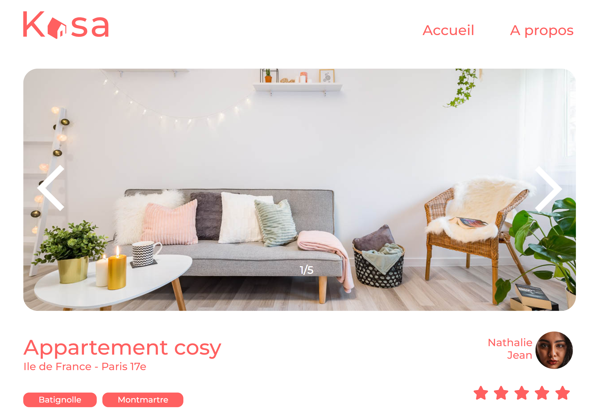

## KASA *Créez une application web de location immobilière avec React*

Projet n°7 du parcours [développeur web chez OpenClassrooms](https://openclassrooms.com/fr/paths185-developpeur-web#path-tabs)

## Contexte du projet
Kasa est dans le métier de la location d’appartements entre particuliers depuis près de 10 ans maintenant.
Elle a donc lancé une refonte totale pour passer à une stack complète en JavaScript avec NodeJS côté back-end, et React côté front-end. 

## Objectifs
- [x] Le but est de réaliser une application web de location immobilière avec React
et de développer l’ensemble de l’application, les composants React, les routes React Router, en suivant les maquettes Figma (responsives !) avec un code de qualité ! 

## Cahier des charges

- [x] [Des maquettes](https://www.figma.com/file/bAnXDNqRKCRRP8mY2gcb5p/ARCHIVE-UI-Design-Kasa-FR?type=design&node-id=3-0&mode=design&t=NnTP84lS0mK1L69q-0) sur Figma pour le design d’interface.

- [x] [Fichier.json](https://s3-eu-west-1.amazonaws.com/course.oc-static.com/projects/Front-End+V2/P9+React+1/logements.json) pour construire le Front qui correspond.

## Contraintes techniques : 
Les coding guidelines de Kasa [ici](https://course.oc-static.com/projects/Front-End+V2/P9+React+1/Coding+guidelines+Kasa+FR.pdf)

## Contraintes fonctionnelles

* Quelques précisions sur les fonctionnalités du site :

- [x] Pour le défilement des photos dans la galerie (composant Gallery) :
Si l'utilisateur se trouve à la première image et qu'il clique sur "Image précédente",  la galerie affiche la dernière image. 
- [x] Inversement, quand l'image affichée est la dernière de la galerie, si l'utilisateur clique sur "Image suivante", la galerie affiche la première image. 
S'il n'y a qu'une seule image, les boutons "Suivant" et "Précédent" n'apparaissent pas.
- [x] La galerie doit toujours rester de la même hauteur, celle indiquée sur la maquette Figma. Les images seront donc coupées et centrées dans le cadre de l’image.
- [x] Collapse : Par défaut, les Collapses sont fermés à l'initialisation de la page. 
Si le Collapse est ouvert, le clic de l'utilisateur permet de le fermer.
Inversement, si le Collapse est fermé, un clic permet de l'ouvrir.

## Technologies & outils Utilisés
- [x] Technologies    
   * ReactJS
- [x] Outils 
   * Figma 
   * Visual Studio Code
   * Git/GitHub

## Contenus de ce repository

## Tourner le Frontend
- [x] le projet est réalisé avec[Create React App](https://github.com/facebook/create-react-app).
- [x] Exécuter `npm install node-sass` pour installer sass.
- [x] pour lancer le serveur : `$ npm run start` ou `$ ng serve`
- [x] Se connecter à l'url: `http://localhost:3000/`http://localhost:3000/
- [x] Exécuter `npm run build`pour déployer l'application

## Connexion
- [x] Ouvrir [localhost:3000](http://localhost:4200/) dans le navigateur.
 
## Compétences évaluées

- [x] Initialiser une application avec Create React App
- [x] Configurer la navigation entre les pages de l'application avec React Router
- [x] Développer des éléments de l'interface d'un site web grâce à des composants React
   
## Lien du projet 

- [x] Le code a été versionné sur Git et déployé sur GitHub à l'addresse suivante:[ https://djaziraoc.github.io/NaitMessaoudDjazira_7_code_23082023/]( https://djaziraoc.github.io/NaitMessaoudDjazira_7_code_23082023/)

## Evaluation
-> Projet validé 
